# electron-video

> 一个本地视频播放器,以本地视频或者图片作为服务器资源,该项目只是自己无聊的产品,编写时间不定

### 2018年9月28日
``` bash
1. 今天把页面结构搭建起来了
2. 组件划分了一下
3. 左侧边栏组件功能编写完毕
```

### 2018年9月29日
``` bash
1. 今天重构了一下页面结构和组件分类
2. 基础搜索组件ui编写完毕
3. 基础logo组件编写完毕
```
#### 具体效果如下
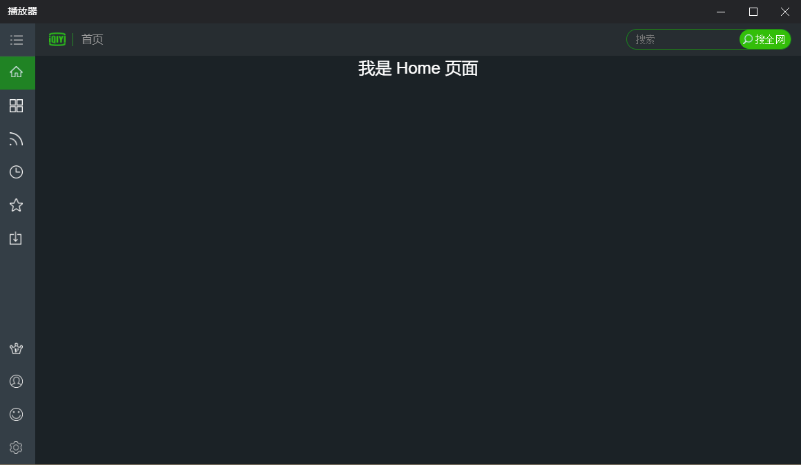
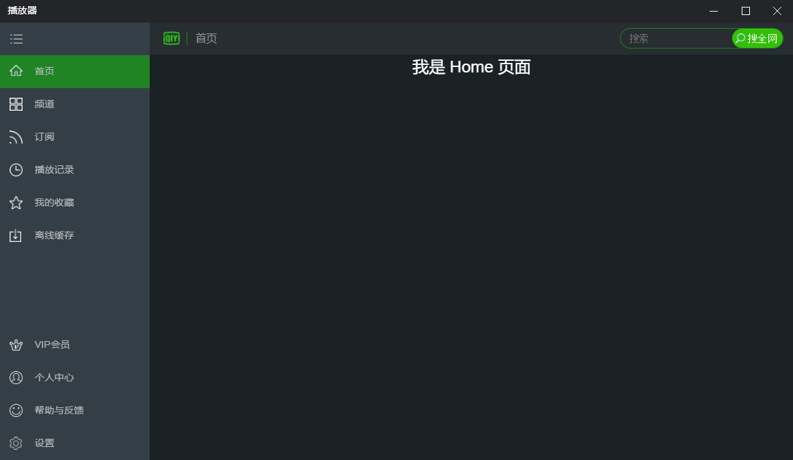

### 2018年10月22日
``` bash
1. 好久没写了,太忙了最近,带着写了如下
2. 编写了添加快速查看nav的组件
3. vuex存储系统的分类编写
```
#### 具体效果如下
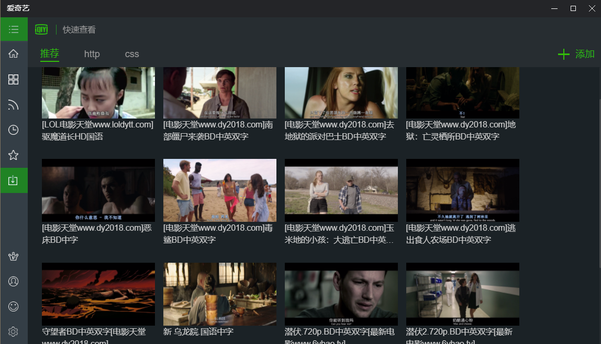
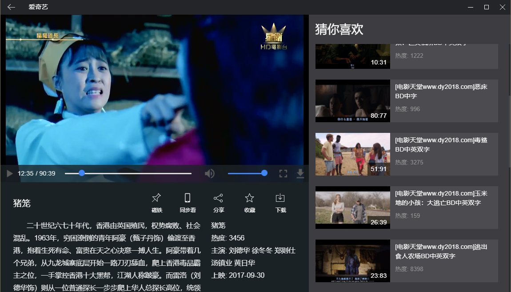
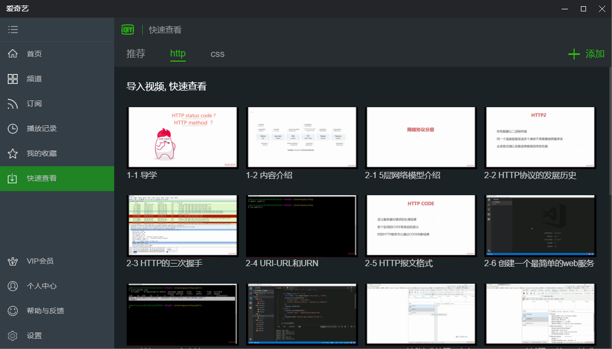

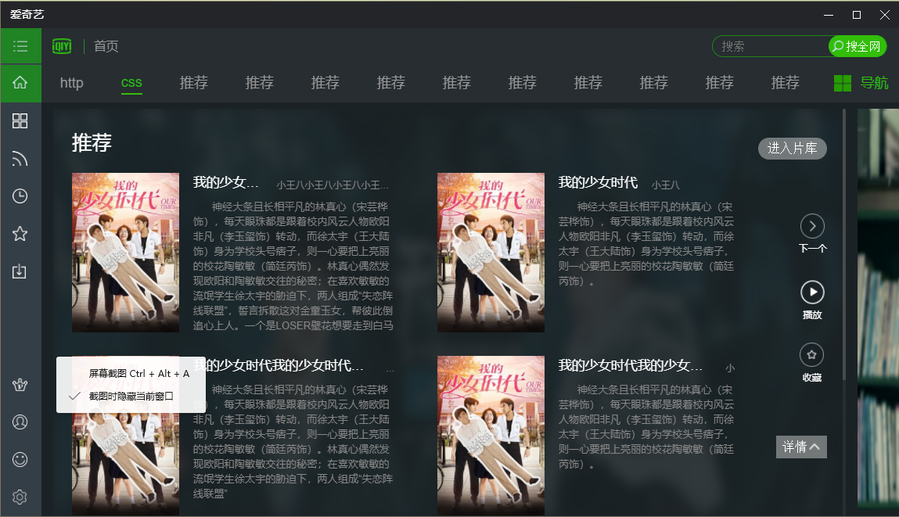
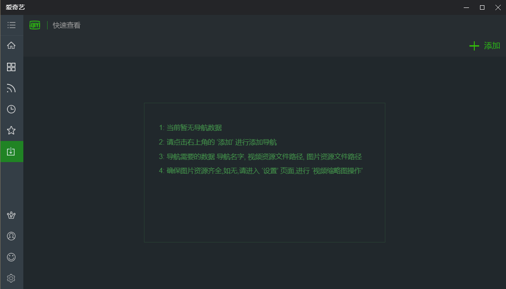
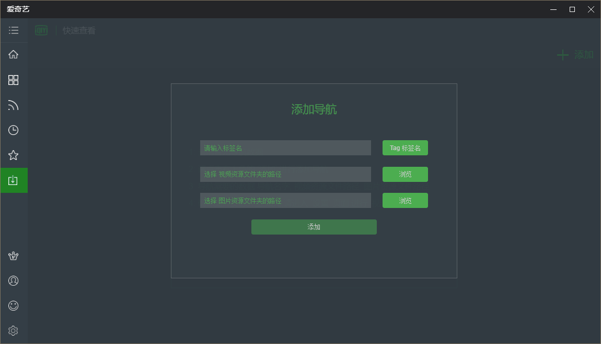

### 2018年10月24日
``` bash
1. 今天编写完快速查看中导航的 增 删 改 功能
2. home组件逻辑写的差不多
```

### 2018年10月26日
``` bash
1. 今天编写了视频播放页 截图,打开视频目录,使用电脑默认程序打开视频功能
```

### 2018年11月14日
``` bash
1. 写了好多,懒得说的了,看图就明白了
2. 下图效果的ui及功能逻辑都编写完毕
```
#### 具体效果如下
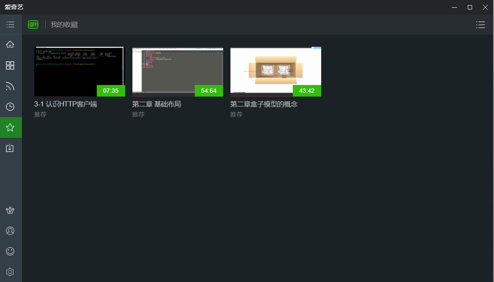
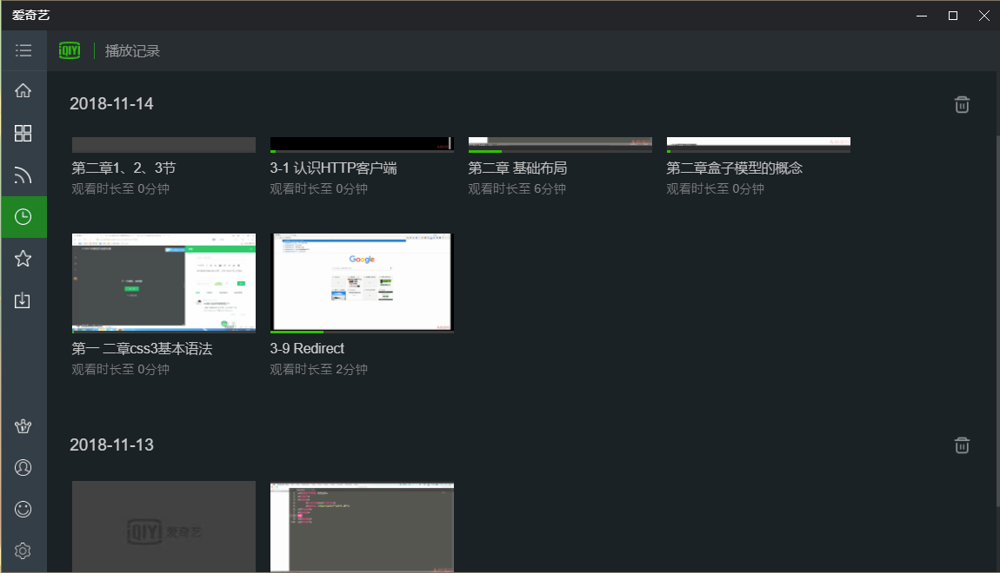
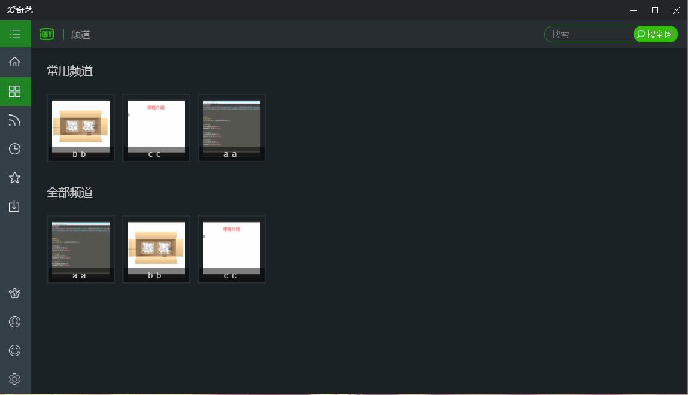
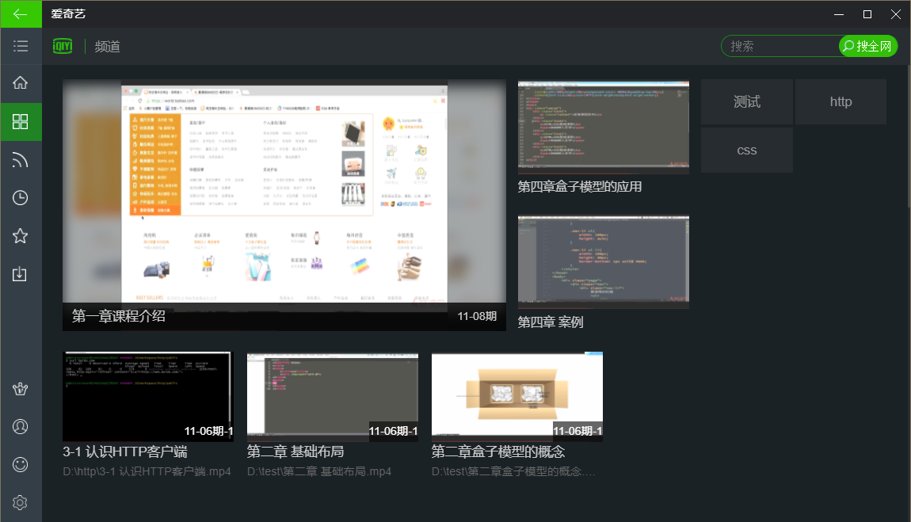
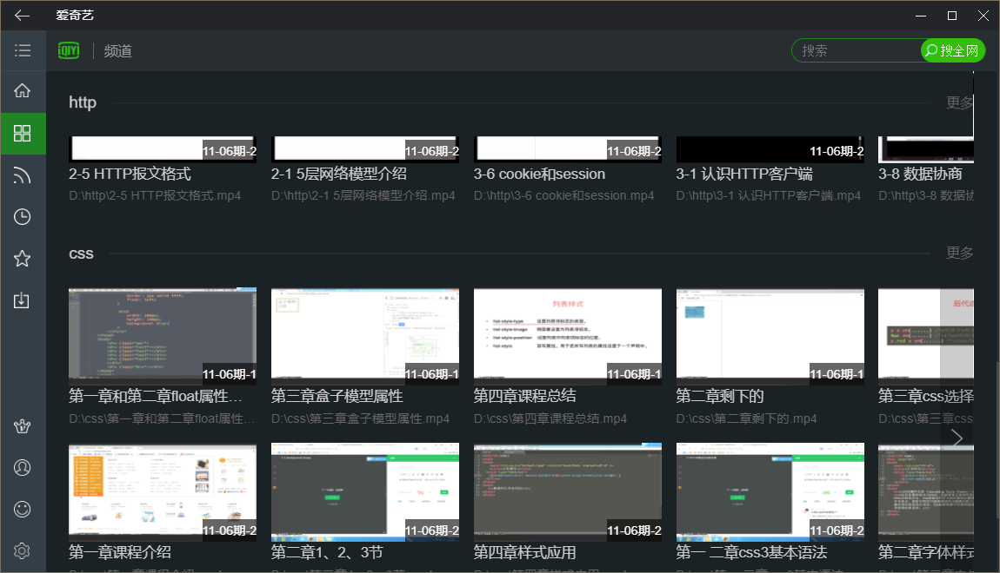
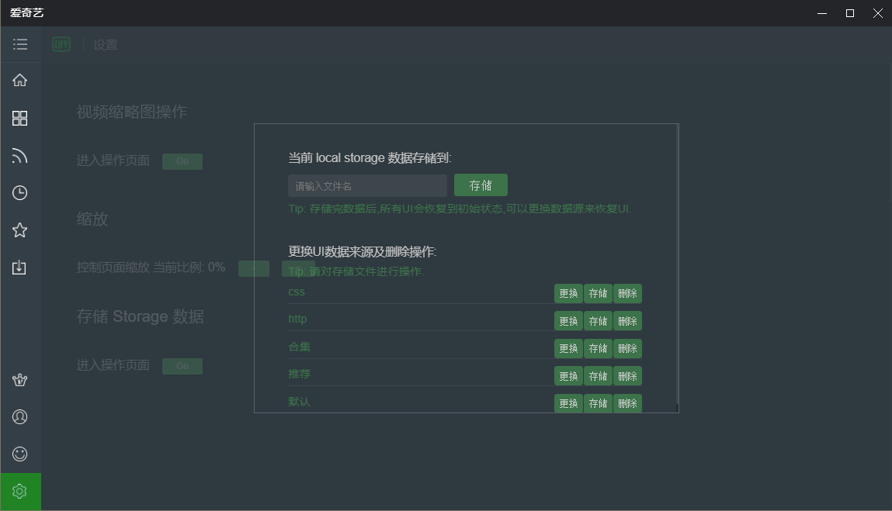

#### Build Setup

``` bash
# install dependencies
npm install

# serve with hot reload at localhost:9080
npm run dev

# build electron application for production
npm run build


```
# electron-video
# electron-video
